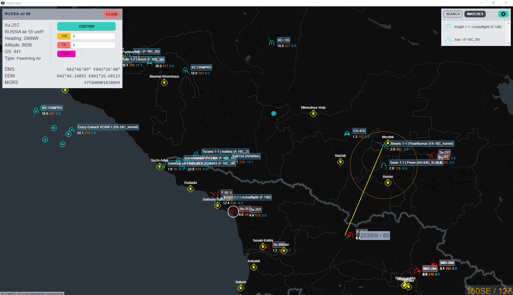
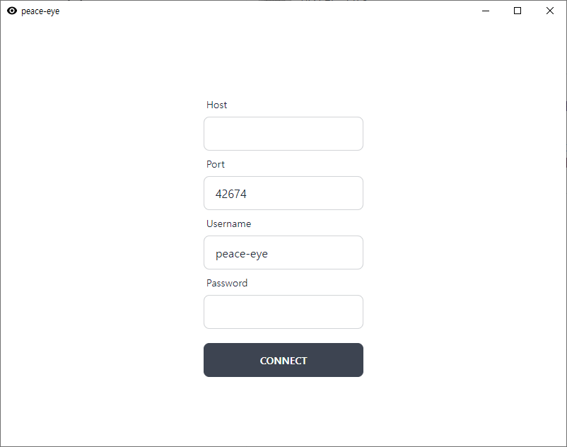

# peace-eye



`peace-eye` is desktop GCI/AWACS simulation for Tacview and DCS World.
Inspired by [b1naryth1ef/sneaker](https://github.com/b1naryth1ef/sneaker).
The name `peace-eye` is derived from [Korean version of Boeing 737 AEW&C "Peace Eye"](https://en.wikipedia.org/wiki/Boeing_737_AEW%26C).
Powered by [tauri](https://tauri.app/).

## Usage

> Server should support Tacview realtime telemetry!

Download the latest release in [Release page](https://github.com/pbzweihander/peace-eye/releases/latest) and install it.



Enter the server's domain or IP in `Host` input.
For example, `dcs.hoggitworld.com` for hoggit GAW.

Enter the Tacview realtime telemetry server's port number in `Port` input.
If you are not sure, just don't touch it.

You can enter anything you like in `Username` input.
It is not relevant.

If your server has password for Tacview realtime telemetry server (not DCS server!), enter it in `Password` input.
For example, hoggit GAW has same DCS server password for Tacview realtime telemetry server. (Which I'm not gonna write it here.)

And press `CONNECT` button.


After waiting some seconds, you can see above screen.
If you are not, check `Host`, `Port`, and `Password` was correct.

This is your main screen.
Various options can be set or unset in settings menu, located on top right cogwheel button.

### Features

- Drag with left click to pan the view.
- Drag with right click to measure bearing and range.
- On the right bottom screen, you can see the bullseye of the cursor location.
  - In settings menu, you can choose to see coordinates of the cursor location.
- In bottom right of each object, you can see altitude (in thousands of feets), estimated ground speed (in knots), estimated altitude rate (in thousands of feets per minutes).
- Click the object to see various information of the object.
  - In object information, you can press `CENTER` button to center the view to the object.
  - You can set warning radius, and thread radius, which represented in yellow and red circle.
  - You can set the object to `Watch` state. Watched objects can be quick-accessed in the top right `WATCHES` button on screen.
- Search the object with name via `SEARCH` button on the top right button on screen.

## Development

### Prerequisites

- [Tauri Prerequisites](https://tauri.app/v1/guides/getting-started/prerequisites)
- [Rust](https://www.rust-lang.org/)
- [Node](https://nodejs.org/en/)

### Running in development mode

```
yarn tauri dev
```

## License

[MIT license](./LICENSE)
